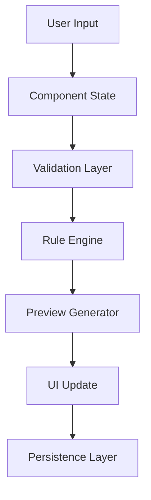

# Rules Management UI/UX Architecture

## Overview

The Rules Management system provides a sophisticated interface for creating and managing complex business rules. The architecture supports two distinct interaction modes while maintaining consistency with the underlying data model.

## Core Components Hierarchy

```
RulesManagement (Container)
├── RuleNavigator (Sidebar)
│   ├── RuleGroupsList
│   ├── RuleTemplateLibrary
│   └── QuickActions
├── RuleWorkspace (Main Content)
│   ├── WizardMode
│   │   ├── RuleWizardSteps
│   │   ├── ContextualHelp
│   │   └── ValidationFeedback
│   └── AdvancedMode
│       ├── RuleCanvas
│       ├── ComponentPalette
│       └── PropertyInspector
└── PreviewPanel (Right Sidebar)
    ├── LivePreview
    ├── ValidationResults
    └── ImpactAnalysis
```

## Dual-Mode Interface

### Wizard Mode
- Progressive disclosure through logical steps
- Contextual help and examples
- Real-time validation
- Smart defaults based on common patterns
- Step navigation with state preservation

Components:
```typescript
interface WizardStep {
  id: string;
  title: string;
  description: string;
  component: React.ComponentType;
  validation: (data: any) => ValidationResult;
  helpContent: React.ReactNode;
}

interface WizardMode {
  steps: WizardStep[];
  currentStep: number;
  stepData: Record<string, any>;
  navigation: {
    next: () => void;
    back: () => void;
    jump: (step: number) => void;
  };
}
```

### Advanced Mode
- Canvas-based workspace with drag-and-drop
- Nested condition builder
- Visual rule flow representation
- Direct JSON editing capability
- Component palette with categorized items

Components:
```typescript
interface CanvasComponent {
  id: string;
  type: 'condition' | 'calculation' | 'group';
  position: { x: number; y: number };
  connections: string[];
  data: any;
}

interface RuleCanvas {
  components: CanvasComponent[];
  selectedComponent: string | null;
  zoom: number;
  pan: { x: number; y: number };
  history: HistoryState[];
}
```

## Rule Visualization

### Component Types
1. Condition Nodes
2. Calculation Nodes
3. Logic Operators
4. Flow Connectors
5. Group Containers

### Visual Feedback
- Color coding for validation states
- Connection highlighting on hover
- Visual indicators for active/inactive states
- Animated transitions for state changes

## Performance Optimizations

### Virtualization
```typescript
interface VirtualizedList {
  itemHeight: number;
  windowSize: number;
  items: any[];
  renderItem: (item: any) => React.ReactNode;
  onScroll: (scrollTop: number) => void;
}
```

### Lazy Loading
- Dynamic imports for complex components
- On-demand loading of rule templates
- Cached preview results

### State Management
```typescript
interface RuleState {
  definition: RuleDefinition;
  validation: ValidationState;
  preview: PreviewState;
  history: HistoryEntry[];
}

interface GlobalState {
  rules: Record<string, RuleState>;
  templates: RuleTemplate[];
  ui: UIState;
}
```

## Progressive Disclosure

### Level 1: Basic
- Simple condition creation
- Predefined templates
- Guided assistance

### Level 2: Intermediate
- Multiple conditions
- Basic calculations
- Template customization

### Level 3: Advanced
- Complex nested conditions
- Custom calculations
- Direct JSON editing
- Advanced visualizations

## Reusable Components

### Smart Components
```typescript
interface SmartField {
  type: FieldType;
  value: any;
  validation: ValidationRule[];
  suggestions: () => Promise<Suggestion[]>;
  onChange: (value: any) => void;
}

interface RuleBlock {
  type: BlockType;
  children: RuleBlock[];
  conditions: Condition[];
  calculations: Calculation[];
}
```

### UI Components
- DraggableCard
- ConditionBuilder
- CalculationEditor
- ValidationIndicator
- ContextualTooltip

## Error Handling

### Validation Levels
1. Field-level validation
2. Rule-level validation
3. Group-level validation
4. Cross-reference validation

### Error Display
- Inline validation messages
- Contextual error highlighting
- Suggestion system for error resolution
- Batch validation reporting

## Data Flow



## Preview System

### Features
- Live rule evaluation
- Sample data testing
- Impact analysis
- Performance metrics
- Conflict detection

### Implementation
```typescript
interface PreviewSystem {
  evaluate: (rule: Rule, context: Context) => Promise<Result>;
  analyze: (rule: Rule) => Promise<Analysis>;
  detectConflicts: (rule: Rule, others: Rule[]) => Conflict[];
  generateSampleData: (schema: Schema) => SampleData;
}
```

## Version Control

### History Management
- Undo/redo stack
- Version comparison
- Change annotations
- Restore points

### Collaboration
- Concurrent editing protection
- Change tracking
- Rule merging strategies

## Accessibility

### Features
- Keyboard navigation
- Screen reader support
- High contrast mode
- Focus management
- ARIA attributes

## Mobile Responsiveness

### Adaptive Layout
- Collapsible panels
- Touch-friendly interactions
- Simplified views for small screens
- Gesture support

## Future Considerations

1. AI-assisted rule creation
2. Natural language rule definition
3. Visual rule mining from data
4. Advanced conflict resolution
5. Rule optimization suggestions

## Implementation Guidelines

1. Use React.memo for performance optimization
2. Implement proper error boundaries
3. Use TypeScript for type safety
4. Follow Material-UI design patterns
5. Maintain consistent state management
6. Implement proper test coverage
7. Document component APIs
8. Use proper code splitting